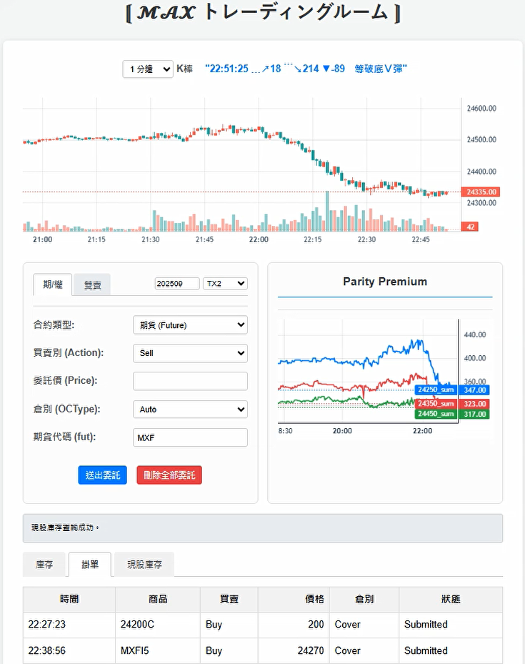

# Shioaji 網頁交易應用程式 (Shioaji Web Trading App)

這是一個基於 Python、FastAPI 和 Shioaji API 的網頁交易介面，讓使用者可以透過瀏覽器進行股票與選擇權的下單、帳戶查詢與圖表分析。

*(請將 `demio.png` 替換為您的應用程式截圖)*

## ✨ 功能特色

- **即時 K 線圖**：提供台指期貨即時 OHLC 數據（1分K、5分K等）。
- **交易訊號指標**：顯示自定義的交易訊號。
- **多功能下單**：支援股票、期貨、選擇權的單式與複式單下單。
- **帳戶狀態查詢**：
    - 查看目前庫存（含零股）。
    - 查詢掛單（委託單）。
    - 計算持倉的整體 Delta 值。
- **一鍵取消**：快速取消所有可取消的委託單。
- **數據分析**：
    - 選擇權價差趨勢圖。
    - 當日成交量排行。

## 🛠️ 技術棧

- **後端**: Python, FastAPI, Uvicorn
- **交易 API**: Shioaji
- **數據處理**: Pandas, NumPy
- **前端**: HTML, CSS, JavaScript (透過 `index.html`)